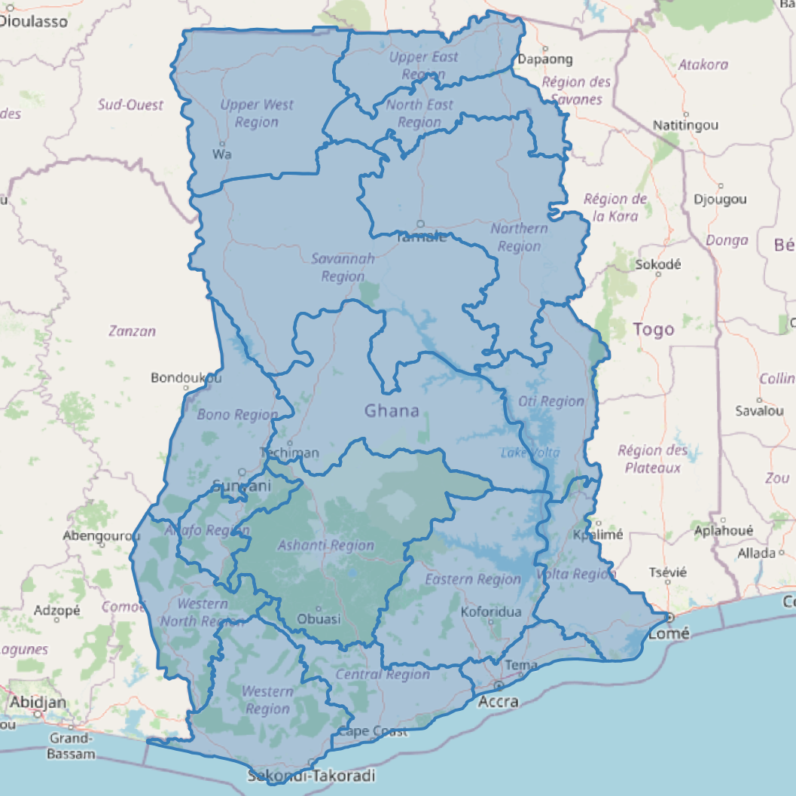

# School Distribution Equity Analysis by Region
## Project README

**Country:** Ghana
**Administrative level:** Region (ADM1)
**Date produced:** 23 May 2026
**Analyst tool:** QGIS 3.x with Python (PyQGIS)
**Project file:** School-Equity-Analysis.qgz

---

## 1. Project Overview

This project analyses the spatial equity of school distribution across Ghana's 16 administrative regions. It quantifies how school provision varies relative to regional area, classifies each region into an equity tier, and flags the four lowest-served regions for priority planning attention.

The outputs are designed to support education planners, government ministries, and development partners in identifying where school infrastructure investment is most urgently needed.

---

## 2. Objective

To produce a decision-ready, region-level dataset that ranks Ghana's administrative regions by school density and classifies them into equity tiers, enabling targeted resource allocation and infrastructure planning.

---

## 3. Input Data

| File | Type | Features | Description |
|------|------|----------|-------------|
| education_facilities.gpkg | Point | 2,912 | School locations across Ghana (OSM-derived). Each feature carries adm1_pcode and adm1_name attributes linking it to its host region. |
| admin_regions.gpkg | Polygon | 16 | Ghana ADM1 administrative boundaries. Carries adm1_pcode, adm1_name, and area_sqkm fields. |

Both input layers are in EPSG:4326 (WGS 84). No reprojection was performed because density calculations use the pre-computed area_sqkm field already present in admin_regions.gpkg rather than geometry-derived areas.

Note: 50 of the 2,912 school features carried a null adm1_pcode value and were excluded from the regional count. The remaining 2,862 features were attributed to their respective regions.

---

## 4. Methodology

### 4.1 School count per region
School counts were derived by grouping education_facilities on the adm1_pcode attribute field. No spatial join was required because the attribute link was already present in the source data.

### 4.2 School density
Density was calculated as:

    schools_per_1000km2 = (school_count / area_sqkm) * 1000

Values are rounded to two decimal places.

### 4.3 Equity tier classification
Quartile boundaries were computed from the 16 density values. Each region was assigned an equity_tier as follows:

| Tier | Condition | Density range (schools per 1,000 km2) |
|------|-----------|---------------------------------------|
| High | density >= Q3 | >= 16.55 |
| Medium-High | Q2 <= density < Q3 | 9.50 to 16.54 |
| Medium-Low | Q1 <= density < Q2 | 6.79 to 9.49 |
| Low | density < Q1 | < 6.79 |

Quartile values: Q1 = 6.79, Q2 = 9.50, Q3 = 16.55

---

## 5. Output Files

| File | Type | Features | Description |
|------|------|----------|-------------|
| school_equity_by_region.gpkg | Polygon | 16 | Primary output. All admin_regions attributes preserved, plus three new fields: school_count, schools_per_1000km2, equity_tier. |
| low_equity_regions.gpkg | Polygon | 4 | Subset of school_equity_by_region where equity_tier = Low. Priority planning overlay. |
| School-Equity-Analysis.qgz | QGIS project | n/a | Fully portable project file with relative paths. Loads all four layers with symbology applied. |
| School_Equity_Analysis_Task_Brief.docx | Word document | n/a | Analyst task brief for independent reproduction. |

### New fields added to school_equity_by_region.gpkg

| Field | Type | Description |
|-------|------|-------------|
| school_count | Integer | Number of schools attributed to this region via adm1_pcode grouping. |
| schools_per_1000km2 | Double | (school_count / area_sqkm) * 1000, rounded to 2 d.p. |
| equity_tier | String | Quartile classification: High, Medium-High, Medium-Low, or Low. |

---

## 6. Results Summary

| Region | Pcode | Schools | Area (km2) | Density | Tier |
|--------|-------|---------|------------|---------|------|
| Greater Accra | GH07 | 771 | 3,699 | 208.42 | High |
| Volta | GH14 | 289 | 9,825 | 29.41 | High |
| Central | GH05 | 249 | 9,664 | 25.77 | High |
| Ahafo | GH01 | 86 | 5,195 | 16.55 | High |
| Western | GH15 | 182 | 14,258 | 12.76 | Medium-High |
| Upper East | GH12 | 103 | 8,622 | 11.95 | Medium-High |
| Eastern | GH06 | 200 | 18,966 | 10.55 | Medium-High |
| Northern | GH08 | 236 | 24,849 | 9.50 | Medium-High |
| Bono | GH03 | 104 | 11,647 | 8.93 | Medium-Low |
| Ashanti | GH02 | 211 | 24,379 | 8.65 | Medium-Low |
| Western North | GH16 | 75 | 10,075 | 7.44 | Medium-Low |
| Bono East | GH04 | 158 | 23,256 | 6.79 | Medium-Low |
| Oti | GH10 | 70 | 11,066 | 6.33 | Low |
| Northern East | GH09 | 34 | 9,075 | 3.75 | Low |
| Upper West | GH13 | 43 | 19,034 | 2.26 | Low |
| Savannah | GH11 | 51 | 35,863 | 1.42 | Low |

**Key finding:** Greater Accra has a density of 208.42 schools per 1,000 km2 compared to Savannah at 1.42, a disparity of approximately 147x. The four Low-tier regions (Savannah, Upper West, Northern East, Oti) are all in the northern belt of Ghana and together cover 75,038 km2 (31.4% of Ghana's land area) but hold only 198 of the 2,862 attributed schools (6.9% of the total).

---

## 7. Symbology

### school_equity_by_region (categorized by equity_tier)

| Tier | Fill colour | Hex code |
|------|-------------|----------|
| High | Dark green | #1a7837 |
| Medium-High | Light green | #78c679 |
| Medium-Low | Yellow | #fee391 |
| Low | Red | #d73027 |
| No Data | Light grey | #cccccc |

All polygon fills use a neutral grey outline (#555555) at 0.26 mm width.

### low_equity_regions
Semi-transparent red fill (alpha 60/255), dark red dashed outline (#8b0000, 0.6 mm). Overlaid on the equity layer to draw visual attention to priority areas.

### admin_regions
Transparent fill, grey outline (#777777, 0.5 mm). Reference boundary context only.

### education_facilities
Blue circles (#3a86ff), 1.6 mm size, no outline.

### Layer draw order (bottom to top)
1. school_equity_by_region
2. admin_regions
3. low_equity_regions
4. education_facilities

---

## 8. How to Open the Project

1. Open QGIS 3.x.
2. Go to Project > Open and navigate to this folder.
3. Select School-Equity-Analysis.qgz.
4. All four layers load with symbology intact.
5. If the canvas appears blank, press Ctrl+Shift+F (Zoom Full) to snap to the Ghana extent.

The project uses relative paths. Keep all files in this folder together. Moving the .qgz without its sibling .gpkg files will break layer links.

---

## 9. Reproducibility Notes

- School counts depend on the adm1_pcode attribute in education_facilities.gpkg being correctly populated. Any feature with a null pcode is excluded from regional totals.
- Density values use area_sqkm from admin_regions.gpkg. If boundaries are updated, re-run the density calculation using the new area values.
- Quartile thresholds are computed dynamically from the 16 density values. Adding or removing regions will shift the tier boundaries and change classifications.
- The task brief document (School_Equity_Analysis_Task_Brief.docx) contains the full analyst-facing specification for independent reproduction of this entire workflow.

---

## 10. File Manifest

    School distribution equity analysis by region/
    |-- README.md                               (this file)
    |-- School-Equity-Analysis.qgz              (QGIS project, relative paths)
    |-- School_Equity_Analysis_Task_Brief.docx  (analyst task brief)
    |-- admin_regions.gpkg                      (input: 16 ADM1 polygons)
    |-- education_facilities.gpkg               (input: 2,912 school points)
    |-- school_equity_by_region.gpkg            (output: equity analysis, 16 polygons)
    |-- low_equity_regions.gpkg                 (output: Low-tier subset, 4 polygons)

---

*Produced using QGIS 3.x and PyQGIS. Data sources: OpenStreetMap (education facilities), OCHA Common Operational Datasets (administrative boundaries).*

---

## Map Preview

